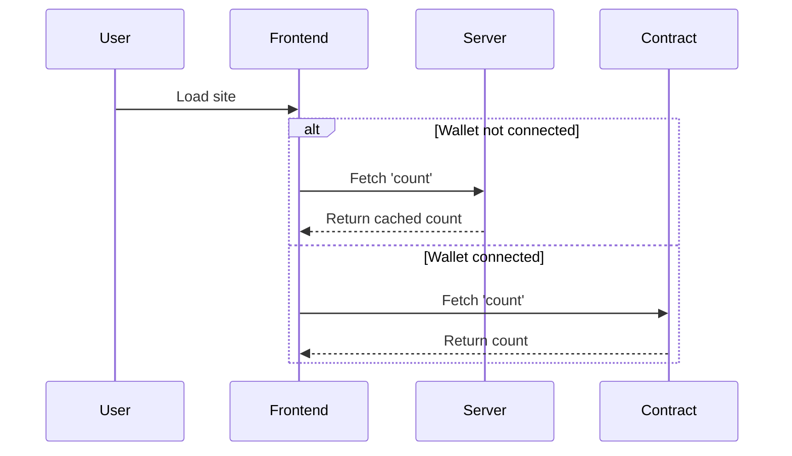
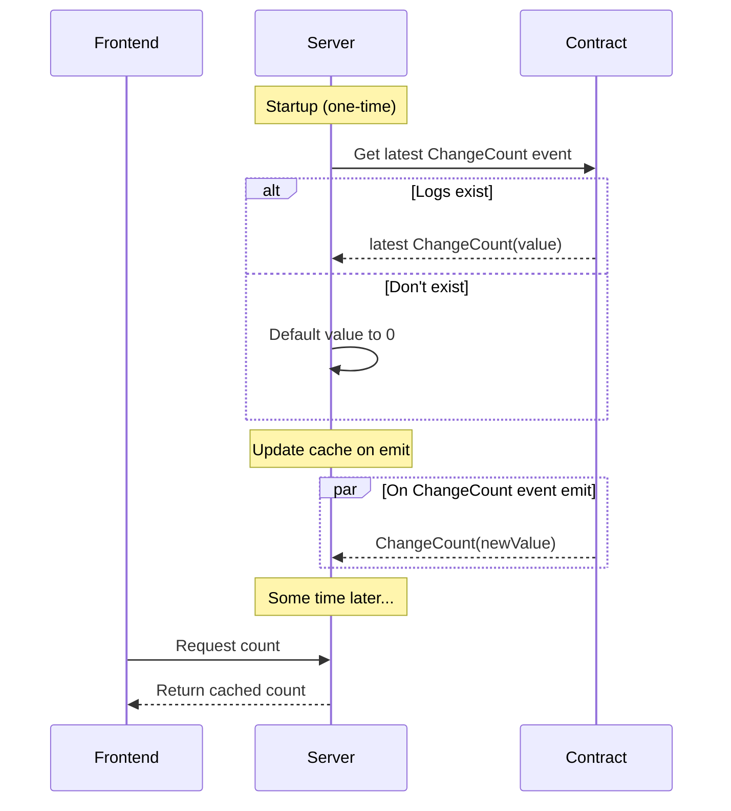

all in separate terminals:
First, start local blockchain:
```
npm run node
```

Then, deploy local contracts to blockhain
```
npm run deploy:local
```

Copy counter contract address to app.js in frontend

then start frontend:
```
npm run frontend
```
you should now be able to interact, make sure to use metamask.


TODO:
 - CONTRACT:
   - [ ] learn mappings
   - [ ] get money transfers working
     - ^ create 'Bank' contract. simple deposit & withdraw, then transfer, etc
   - [ ] learn more about events, errors, structs & other things solidity
   - [ ] investigate off-chain computation (indexers)
   - [ ] learn about why structs / events gotta be stored memory-efficiently 
   - [ ] make a proper pot
   - [ ] zero knowledge proofs to prove correctness

 - FRONTEND:
   - [ ] event handling, contract & frontend
   - [ ] handle accountsChanged metamask event
   - [ ] tidy up styles.css
   - [ ] (later) leaderboard?
   - [ ] use artifacts for generated ABI
   - [x] fix css styling js
   - [x] clickme button functionality (!)


 - test in workspace first & learn properly. continue investigating & figuring things out for myself
 - create a listener service for contract to save unnecessary writes on blockchain. write off-chain based on events. should this be on backend for the web page? then http get 
  - onload client subscribes, server then waits for contract emit, then publishes to subscribers. 
  - persist event data using sqlite?
  - make use of docker !? :D Maybe get Laszlo to walk me through it...


NOTES:
 - perhaps every ~100 tokens mined, create a pot? protocol-based generation
 - stake floating pot balance
 - streaks , leaderboard for this etc , stacks?

> [!IMPORTANT]
> i have since realised a large amount of my idea beneath is defunct purely because contracts can be read from from the frontend without the use of metamask. They can just read via the rpc url without a signer required.

### Given above, what I will be planning to do:

'Contract Proxy / Interface' - probably use a proxy object or some way of interfacing a read & write contract. 
- Add functionality to connect your wallet manually (Top right where wallet details are shown)
- When trying to write, prompt to connect wallet. Issue here is how do we know when trying to write / read ? When calling function that isn't a view?

<br><br>

# will do (WONT DO MOST OF THIS)
Maybe create a backend service, at first purely to listen to events to serve to frontend? Rather than requiring frontend to register. Could do a nice UX/UI to 'Assign Wallet' or some button which then prompts MetaMask.  'Connect Wallet' ?
This is important because currently need to connect wallet in order to look at contract, i.e. get/fetch values. This may be bad deisgn? Asking to connect wallet on page load lol. Not sure.
If you subscribe to values on server, frontend onload could fetch values from server. This way can view frontend fine, just can't interact. 

## There is a concern for security here.
Some people may be uncomfortable with viewing data tracked from server. For example, server may be listening to a separate, but similar contract than the one being advertised on the frontend. This could lead to people thinking they are paying money towards one contract but in reality going to some other contract. 

Much better to keep things decentralised - but then, how can you do off-chain computation to save gas money for writes?

### my thought process
Perhaps the right approach would be to ask the user on load to connect wallet (to circumvent needing server)? But then we're just at the start of the problem again... 
Another viable solution would be to only fetch from server onload, then listen to contract... Can't do that because to get contract need to connect wallet... D:
So realistically it's either ask to connect wallet or server ..?
Wait a sec, does it really matter until user is prepared to send a 'set' command (pay)? They'll need to hook up wallet in that instance. Perhaps if we can visually express a 'reload' to indicate now listening locally, and send a toast just to make sure? 
^ Should that be default behaviour, or perhaps ask if they want to listen locally or server? It should be local for their own sake.. Also, it's a trust signal potentially ? - only as long as they're notified the reload is intentional. Otherwise don't visually 'reload' (i.e. counter text flashes '--' default value for half a second?) - this may be the opposite of a trust signal ahah confusing.
Atleast we know what's certain. I'll be writing a backend server to act as a proxy between contract & client for gets. 

Perhaps an idea would be to create an interface which handles this automatically? 
 - If no wallet, fetch from server (pass value name & contract address as fields?)
 - If wallet detected, refresh & fetch from contract.
 - If disconnect detected, back to original server logic.

Backend HTTP API ? Requires contract address & value name. Backend handles listening to event, caching, returning value etc. Interface design must support multiple different events/values. Basically should map emitted event to specific value. 
 - In future need to be conscious of storing state in memory. Be mindful of distributed systems. (may be good use of redis!) (interesting to see services deployed on docker, future todo?)

One issue is, if we are using the server as a store, how does the server get the value on startup? It is possible to calculate based on querying event LOGs. Use the most recent event for up-to-date value.
```js
const events = await contract.queryFilter("ValueChanged");
```

### Frontend Flow Diagram


### Backend Flow Diagram


This highlights a potential issue - what if server does not have cached value available?